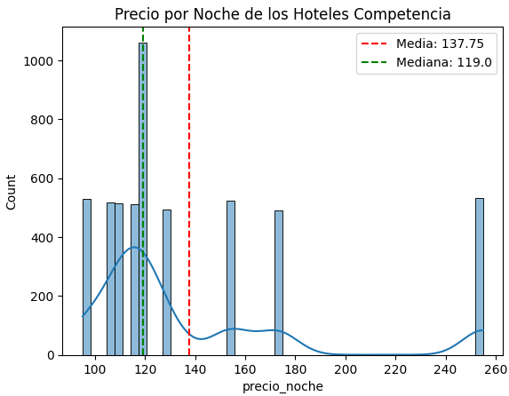
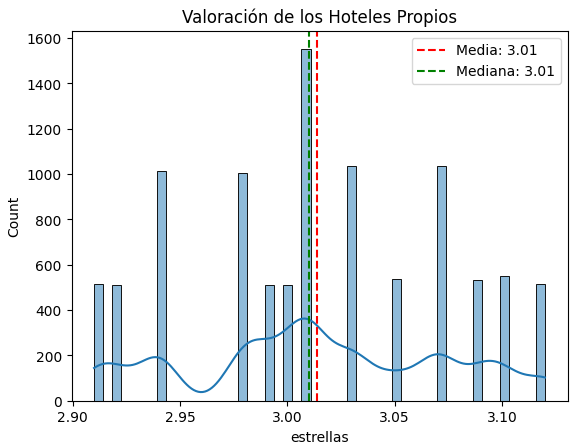
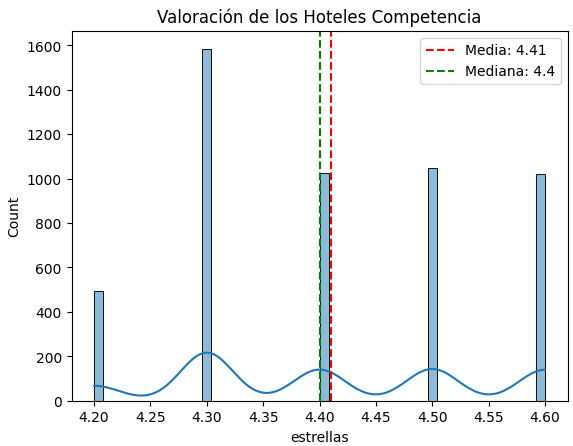
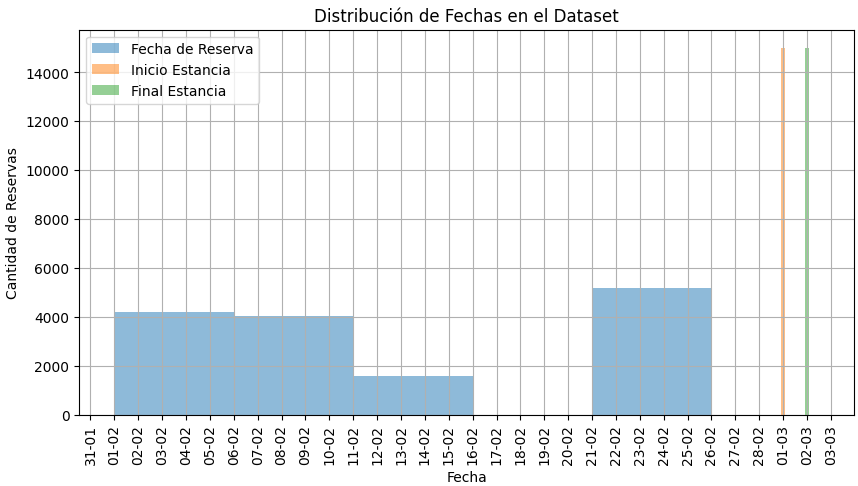

# 🏨 Proyecto ETL: Análisis de Reservas Hoteleras en Madrid

## 📖 Descripción del Proyecto
Este proyecto tiene como objetivo la implementación de un proceso **ETL (Extract, Transform, Load)** para gestionar y analizar datos de reservas hoteleras en Madrid. Se parte de un **archivo Parquet** con información de hoteles propios y de la competencia, que posteriormente se enriquece con datos de una **API de eventos** del Ayuntamiento de Madrid y **web scraping** de hoteles de la competencia.

## 📂 Estructura del Proyecto
```
Proyecto_ETL_Hoteles/
│
├── data/                      # Datos crudos y procesados
│   ├── api/                   # Datos extraídos de la API
│   ├── limpieza/              # Datos transformados y limpios
│   ├── web_scrapping/         # Datos obtenidos mediante scraping
│   └── reservas_hoteles.parquet # Archivo original
│
├── notebooks/                 # Notebooks de Jupyter con el desarrollo del proyecto
│   ├── api.ipynb              # Extracción de datos desde la API
│   ├── carga_BBDD.ipynb       # Carga de los datos a la base de datos
│   ├── consultas_BBDD.ipynb   # Análisis exploratorio y consultas SQL
│   ├── final.ipynb            # Integración final de ETL
│   ├── inicial.ipynb          # Exploración inicial de los datos
│   ├── web_scrapping.ipynb    # Extracción de datos desde la web
│
├── img/                       # IMágenes para el archivo README.md
│
├── venv/                      # Entorno virtual
│
├── README.md                  # Documentación del proyecto
├── .gitignore                  # Archivos a ignorar en el repositorio
└── requirements.txt            # Dependencias necesarias
```

## 🛠 Instalación y Requisitos
Este proyecto ha sido desarrollado en **Python 3.8+** y requiere las siguientes librerías:

```bash
pip install -r requirements.txt
```

Las librerías utilizadas incluyen:
- **pandas**: Manipulación y limpieza de datos.
- **numpy**: Operaciones numéricas.
- **matplotlib y seaborn**: Visualización de datos.
- **selenium y webdriver-manager**: Web scraping.
- **SQLAlchemy y psycopg2**: Conexión y manipulación de bases de datos PostgreSQL.

## 🛠 Proceso ETL
### 🔍 Extracción de Datos
1. **Lectura del archivo Parquet** con datos de reservas hoteleras.
2. **Extracción de datos de la API** del Ayuntamiento de Madrid con información de eventos.
3. **Scraping de hoteles de la competencia** mediante Selenium y BeautifulSoup.

### 🔄 Transformación de Datos
- Eliminación de valores nulos y duplicados.
- Formateo de fechas y correcciones de nombres.
- Enriquecimiento de datos con información externa.

### 📥 Carga en la Base de Datos
- **Creación del esquema SQL** con PostgreSQL usando SQLAlchemy.
- Inserción de datos en tablas relacionadas:
  - `ciudad`
  - `eventos`
  - `hoteles`
  - `clientes`
  - `reservas`

## 📊 Análisis de Datos y Resultados
### 📈 Distribución de Precios por Noche
Se ha realizado un análisis comparativo entre los **hoteles propios** y los de la **competencia**, encontrando que:
- El precio medio por noche en los hoteles propios es **275 €**, mientras que en los de la competencia es **137,75 €**.
- Los hoteles propios tienen una **mayor variabilidad de precios**.

**Gráfico:**



### ⭐ Valoración de Hoteles
- La valoración media de los hoteles propios es **3.01**, mientras que la de los hoteles de la competencia es **4.41**.

**Gráfico:**




###  Fecha de reservas
- Las reservas de los hoteles de la competencia se realizaron con menos tiempo de antelación a la fecha de inicio de la estancia, lo que puede reflejar un tipo de cliente distinto que viaja por negocios respecto a nuestro tipo de perfil de cliente que puede ser un perfil más familiar que viaja por ocio.




### 💰 Top Clientes que Más Han Gastado
Identificamos los **clientes con mayor gasto**, siendo **Ceferino Sosa** el que más ha gastado (**888,93 €**).

**Tabla:**
| Cliente          | ID Cliente | Total Gastado (€) |
|-----------------|------------|----------------|
| Ceferino Sosa   | 2713       | 888.93        |
| Leandra Castañeda | 8218   | 823.44        |

### 🏨 Hoteles con Mayor Recaudación
Identificamos los hoteles con mayor recaudación:
- **Hotel Propio con Mayor Ingreso:** *Hotel Camino del Sol* (**152.136,81 €**).
- **Hotel de la Competencia con Mayor Ingreso:** *Novotel Madrid Center*.

## 📌 Conclusiones y Hallazgos
- **Nuestros hoteles tienen precios significativamente más altos** que los de la competencia, pero no se reflejan en una mejor valoración.
- **Las reservas en la competencia se concentran en fechas específicas**, mientras que en nuestros hoteles están distribuidas a lo largo del mes.
- **Los eventos en Madrid podrían influir en las reservas**, por lo que podría ser una estrategia valiosa para ajustar los precios dinámicamente.

## 🚀 Futuros Pasos
- Empaquetar código en funciones
- Extraer las variables de entorno
- Maquetar proyecto con archivos .py
- Automatizar la **extracción de datos** para actualizaciones periódicas.


## 🤝 Contribuciones
Las contribuciones son bienvenidas. Si deseas mejorar el proyecto, puedes abrir un **pull request** o contactar conmigo.

## ✒️ Autor
**Víctor Forés**


